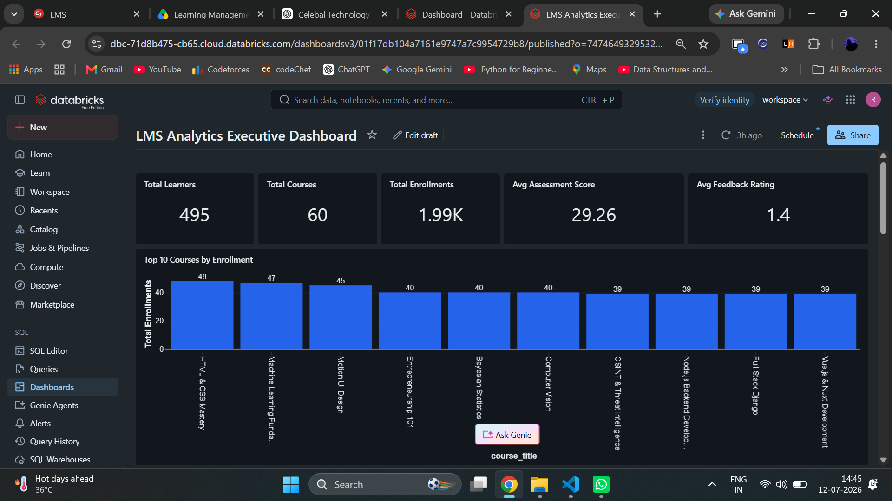

# 📊 LMS Analytics Executive Dashboard

## Overview

The **LMS Analytics Executive Dashboard** is the final visualization layer of the **LMS Analytics Platform**, developed using **Databricks SQL Dashboard**. It transforms curated Gold Layer Delta tables into meaningful business insights through interactive KPI cards, charts, and analytical visualizations.

The dashboard enables stakeholders to monitor learner engagement, course performance, instructor effectiveness, subscription trends, and geographical distribution, supporting data-driven decision-making.

---

# 🎯 Dashboard Objectives

The dashboard is designed to help business users:

- Monitor overall LMS platform performance
- Track learner enrollments
- Measure course popularity
- Analyze subscription distribution
- Evaluate instructor performance
- Monitor learner distribution across cities
- Compare learner progress with assessment scores
- Support executive-level decision making

---

# 🖥️ Dashboard Preview

<p align="center">



</p>

---

# 🏗 Dashboard Architecture

```text
Gold Layer Delta Tables
          │
          ▼
Databricks SQL Warehouse
          │
          ▼
SQL Datasets
          │
          ▼
Interactive Dashboard Widgets
          │
          ▼
Business Insights
```

---

# ⚙ Technology Stack

| Component    | Technology                   |
| ------------ | ---------------------------- |
| Dashboard    | Databricks SQL Dashboard     |
| Query Engine | Databricks SQL Warehouse     |
| Data Source  | Gold Layer Delta Tables      |
| Processing   | Azure Databricks             |
| Storage      | Azure Data Lake Storage Gen2 |
| Data Format  | Delta Lake                   |

---

# 📈 Executive KPIs

The Executive Dashboard displays the following Key Performance Indicators.

| KPI                      | Description                      |
| ------------------------ | -------------------------------- |
| Total Learners           | Total registered learners        |
| Total Courses            | Total available courses          |
| Total Enrollments        | Overall learner enrollments      |
| Average Assessment Score | Average learner assessment score |
| Average Feedback Rating  | Average learner feedback rating  |

---

# 📊 Dashboard Visualizations

---

## 1️⃣ Executive Dashboard Overview

Provides a complete overview of all executive metrics and business analytics.


---

## 2️⃣ KPI Cards

Displays executive KPIs including:

- Total Learners
- Total Courses
- Total Enrollments
- Average Assessment Score
- Average Feedback Rating


---

## 3️⃣ Top Courses by Enrollment

Displays the most popular courses based on learner enrollments.

### Business Value

- Identify high-demand courses
- Understand learner interests
- Support curriculum planning


---

## 4️⃣ Category-wise Subscription Distribution

Visualizes learner subscription distribution across different course categories.

### Business Value

- Identify subscription trends
- Compare category performance
- Support business growth strategies


---

## 5️⃣ Instructor Performance & City Analysis

Provides instructor performance insights together with city-wise learner distribution.

### Business Value

- Measure instructor effectiveness
- Analyze regional learner growth
- Improve resource planning


---

## 6️⃣ Top Cities by Learners

Displays cities with the highest learner registrations.

### Business Value

- Identify high-performing regions
- Support regional marketing
- Improve expansion planning


---

## 7️⃣ Course Progress vs Assessment Score

Compares learner progress against assessment performance.

### Business Value

- Measure learning effectiveness
- Evaluate learner engagement
- Improve course quality


---

# 🗄 SQL Datasets Used

The dashboard is powered by the following analytical datasets.

| Dataset              | Purpose                      |
| -------------------- | ---------------------------- |
| Gold Overview        | Executive KPI Cards          |
| Course Summary       | Course Performance Analytics |
| Category Summary     | Category-wise Insights       |
| Instructor Summary   | Instructor Performance       |
| Subscription Summary | Subscription Analysis        |
| City Summary         | Geographic Analytics         |

---

# 📷 Dashboard Gallery

| KPI Cards                                                             | Top Courses                                                             |
| --------------------------------------------------------------------- | ----------------------------------------------------------------------- |
|  |  |

| Category Distribution                                                             | Instructor Performance                                                      |
| --------------------------------------------------------------------------------- | --------------------------------------------------------------------------- |
|  |  |

| Top Cities                                                                         | Progress vs Assessment                                                          |
| ---------------------------------------------------------------------------------- | ------------------------------------------------------------------------------- |
|  |  |

---

# 💼 Business Insights Generated

The Executive Dashboard enables stakeholders to:

- Monitor platform growth
- Track learner engagement
- Identify popular courses
- Analyze subscription trends
- Evaluate instructor performance
- Understand geographical learner distribution
- Measure learning effectiveness
- Support strategic business decisions

---

# ✨ Dashboard Features

- Executive KPI Cards
- Interactive Charts
- Databricks SQL Integration
- High-performance SQL Queries
- Gold Layer Data Consumption
- Real-time Dashboard Refresh
- Business Intelligence Reporting
- Executive Decision Support

---

# 🔄 End-to-End Workflow

```text
Raw CSV Files
      │
      ▼
Azure Data Factory
      │
      ▼
Azure Data Lake Storage Gen2
      │
      ▼
Bronze Layer
      │
      ▼
Silver Layer
      │
      ▼
Gold Layer
      │
      ▼
Databricks SQL Warehouse
      │
      ▼
SQL Datasets
      │
      ▼
Executive Dashboard
      │
      ▼
Business Insights
```

---

# ✅ Dashboard Status

| Component               | Status       |
| ----------------------- | ------------ |
| Dashboard Developed     | ✅ Completed |
| SQL Warehouse Connected | ✅ Completed |
| KPI Cards               | ✅ Completed |
| Interactive Charts      | ✅ Completed |
| Published Dashboard     | ✅ Completed |
| Screenshots Captured    | ✅ Completed |
| Documentation           | ✅ Completed |

---

# 🎯 Conclusion

The **LMS Analytics Executive Dashboard** represents the final analytics layer of the LMS Analytics Platform. By leveraging **Azure Databricks**, **Databricks SQL Warehouse**, and curated **Gold Layer Delta Tables**, the dashboard converts raw educational data into actionable business intelligence.

It provides executives and stakeholders with an intuitive, interactive, and scalable analytics solution for monitoring learner activity, evaluating course performance, assessing instructor effectiveness, and making informed data-driven decisions.
